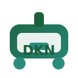

<p align="center">
  
</p>

<h1 align="center">Dockan</h1>

<p align="center">
  A simple local Docker alternative for Linux.
</p>

<p align="center">
  <a href="https://github.com/Dockan-Conteneurisation-libre/Dockan/actions/workflows/ci.yml"></a>
  <a href="https://github.com/Dockan-Conteneurisation-libre/Dockan/releases"></a>
  <a href="LICENSE"></a>
  
  
  
</p>

---

It helps you:

- build local images
- run apps
- keep containers running in the background
- read logs
- use a `dockan.yml` file
- install an app as a Linux service

Dockan does not need a daemon.

Important concept: Dockan stays local. It does not automatically download from Docker Hub. Bases, dependencies, and app files must exist on your machine or be provided with the project.

Dependencies can be installed through `apt`, `dnf`, `apk`, `pacman`, or `zypper`, but only when you explicitly run the command. Dockan does not install packages secretly.

## Dockan vs Docker

Dockan is a real Docker alternative for local Linux workflows, especially when you want a smaller tool that stays understandable and does not require a permanent daemon or a cloud registry.

Use Dockan when you want:

- a daemonless container tool
- local-first images and app sharing
- no required Docker Hub account or central registry
- simple `Dockanfile` / Dockerfile-style builds
- readable folders, archives, checksums, and service files
- apps installed as normal Linux systemd services
- an easier path for self-hosting, labs, education, and internal tools

Use Docker when you need:

- the full Docker Hub ecosystem
- mature OCI image layers and caching
- full Dockerfile compatibility
- very robust internal DNS and networking
- large production fleets already standardized on Docker/Kubernetes
- the broadest third-party tooling support

| Need | Dockan | Docker |
| --- | --- | --- |
| Local app runner | Yes | Yes |
| Permanent daemon required | No | Usually yes |
| Forced cloud registry | No | No, but Docker Hub is central in the ecosystem |
| Simple local registry | Folder-based `dockan push` / `dockan pull` | Registry server |
| Dockerfile support | Common instructions | Full Dockerfile support |
| Runtime bases | Host runtimes or local rootfs bases | OCI images from registries |
| Internal DNS | Hosts-file based | Dynamic DNS |
| Best fit | Simple local/self-hosted apps | Large standard container ecosystem |

Short version: Dockan is for people who want Docker-like app running with less machinery. Docker is still better when you need the full industry ecosystem.

## Install

User install, without sudo:

```bash
curl -fsSL https://raw.githubusercontent.com/Dockan-Conteneurisation-libre/Dockan/main/scripts/install.sh | sh
```

If `~/.local/bin` is not in your `PATH`, add it:

```bash
export PATH="$HOME/.local/bin:$PATH"
```

System-wide install:

```bash
curl -fsSL https://raw.githubusercontent.com/Dockan-Conteneurisation-libre/Dockan/main/scripts/install.sh | sudo sh
```

From a local checkout:

```bash
sudo INSTALL_SOURCE=source sh scripts/install.sh
```

Check the machine:

```bash
dockan version
dockan doctor
dockan ps -a
```

Update later:

```bash
dockan update
```

Update to a specific release:

```bash
dockan update --version v0.1.1
```

Update a system-wide installation:

```bash
dockan update --system
```

## Quick Test

Build the example:

```bash
dockan build -t hello:latest examples/hello
```

Run it:

```bash
dockan run hello:latest
```

List images:

```bash
dockan images
```

## Run In The Background

```bash
dockan run -d --name hello hello:latest
dockan ps -a
dockan logs hello
```

Stop and remove:

```bash
dockan stop hello
dockan rm hello
```

Run a command inside a running container:

```bash
dockan exec hello sh
```

## Create An App

Start from a language template:

```bash
dockan new php my-php-app
dockan new node my-node-app
dockan new python my-python-app
dockan new go my-go-app
dockan new rust my-rust-app
dockan new java my-java-app
dockan new ruby my-ruby-app
dockan new binary my-binary-app
```

In your app folder, create `Dockanfile`:

```dockerfile
FROM scratch
LABEL org.opencontainers.image.title=MyApp
COPY app.sh /app.sh
RUN chmod +x /app.sh
CMD ./app.sh
```

Create `app.sh`:

```bash
#!/usr/bin/env sh
echo "Hello from Dockan"
```

Then:

```bash
dockan build -t myapp:latest .
dockan run myapp:latest
```

You can also use a simple local `Dockerfile` when no `Dockanfile` exists.

Supported Dockerfile instructions:

- `FROM`
- `COPY`
- `ADD`
- `RUN`
- `CMD`
- `ENTRYPOINT`
- `ENV`
- `WORKDIR`
- `EXPOSE`
- `VOLUME`
- `LABEL`
- `ARG`
- `USER`
- `SHELL`
- `STOPSIGNAL`
- `HEALTHCHECK`

Dockan also reads `.dockerignore` to avoid copying useless or sensitive files into the image.

## Run Any Language

Dockan can run any Linux language/runtime when the machine or the image has what the app needs:

- PHP, Node.js, Python, Ruby, Java, Go, Rust, shell, and static binaries
- Docker-style names such as `php:8.3`, `node:20`, `python:3.12`, `openjdk:21`, and `golang:1.22` without Docker Hub
- real local bases such as `php:local`, `node:local`, `python:local`, or `java:local`
- static Linux binaries with `FROM scratch`

Examples:

```dockerfile
FROM php:8.3
WORKDIR /app
COPY . /app
EXPOSE 8000
CMD php -S 0.0.0.0:8000 -t public
```

```dockerfile
FROM node:20
WORKDIR /app
COPY . /app
EXPOSE 3000
CMD ["node", "server.js"]
```

When `php:8.3` or `node:20` is not imported as a Dockan base, Dockan uses the local host runtime (`php`, `node`, etc.) and never downloads from Docker Hub.

Full guide: [Run Any Language](docs/languages.md)

Simple multi-stage build:

```dockerfile
FROM scratch AS builder
COPY app /out/app

FROM scratch
COPY --from=builder /out/app /app
CMD ./app
```

## Developer App Sharing

Developers can package a Dockan app as a normal project:

```text
myapp/
  Dockanfile
  dockan.yml
  README.md
  app.sh
  src/
```

Admins can then fetch the project, build locally, and run locally:

```bash
tar -xzf myapp-dockan-v1.tar.gz
cd myapp
dockan build -t myapp:v1 .
dockan compose up
```

To start on boot:

```bash
sudo dockan service install -f /srv/myapp/dockan.yml --name myapp
sudo systemctl daemon-reload
sudo systemctl enable --now dockan-myapp.service
```

Full guide: [Developer Guide](docs/developer.md)

## Local Bases

Import a local base:

```bash
dockan base import alpine:local ./alpine-rootfs
```

Create a local base with a more readable command:

```bash
dockan base create alpine:local --from ./alpine-rootfs
```

Or import from a local archive:

```bash
dockan base import ubuntu:local ./ubuntu-rootfs.tar.gz
```

Create a complete runtime base from a prepared rootfs:

```bash
dockan base runtime php:8.3 --from ./php83-rootfs
dockan base runtime node:20 --from ./node20-rootfs.tar.gz
```

This is the path for stronger isolation: the runtime and its libraries live inside the image instead of relying on the host runtime.

Then use that base:

```dockerfile
FROM alpine:local
COPY app.sh /app.sh
CMD ./app.sh
```

Nothing is downloaded automatically.

## Dependencies

Check the available package manager:

```bash
dockan deps check
```

Show the command without installing:

```bash
dockan deps install --dry-run curl git
```

Install through the machine package manager:

```bash
sudo dockan deps install -y curl git
```

Choose the manager:

```bash
sudo dockan deps install --manager dnf -y curl git
```

Install a runtime for a Docker-style base without Docker Hub:

```bash
dockan deps runtime php:8.3 --dry-run
sudo dockan deps runtime php:8.3 -y
sudo dockan deps runtime node:20 -y
sudo dockan deps runtime python:3.12 -y
```

This installs on the local Linux machine. It is not Docker Hub.

## Volumes

Create a named volume:

```bash
dockan volume create data
```

Run an app with that volume:

```bash
dockan run -d --name web -v data:/data web:latest
```

Mount a local folder:

```bash
dockan run -d --name web -v ./data:/data web:latest
```

List volumes:

```bash
dockan volume ls
```

Back up a volume:

```bash
dockan volume backup data data-backup.tar.gz
```

Restore into a new empty volume:

```bash
dockan volume restore data-restored data-backup.tar.gz
```

Remove a volume:

```bash
dockan volume rm data
```

## Simple Compose

Create `dockan.yml`:

```yaml
name: myapp
services:
  web:
    build: .
    image: web:latest
    ports:
      - 8080:8080
    env:
      - PORT=8080
    volumes:
      - data:/data
    network: appnet
    aliases:
      - web.local
    depends_on:
      - db
    restart: always
    healthcheck: CMD-SHELL curl -f http://127.0.0.1:8080/
    memory: 512m
    cpus: 1.5
  db:
    image: db:latest
    volumes:
      - db-data:/var/lib/db
    env:
      - DB_NAME=myapp
      - DB_USER=myapp
      - DB_PASSWORD=change-me
    aliases:
      - db
    network: appnet
    healthcheck: CMD-SHELL test -d /var/lib/db
networks:
  - appnet
```

Run:

```bash
dockan compose up
```

Stop:

```bash
dockan compose down
```

Check all service healthchecks:

```bash
dockan compose health
```

Use another file:

```bash
dockan compose up -f examples/compose/dockan.yml
```

For app plus database projects, Dockan supports `depends_on`, shared networks, aliases, environment variables, and persistent volumes. Database init scripts and standard user/password variables must still be handled by the database image or by the app's own `hooks/prestart` script.

## Local Registry

Dockan has a simple local registry alternative. It is just a folder containing image archives, checksums, and an index.

```bash
dockan push myapp:latest /srv/dockan-registry
dockan registry ls /srv/dockan-registry
dockan pull myapp:latest /srv/dockan-registry
```

This is useful for a team, a NAS, a USB drive, or an internal server share. It is not Docker Hub and does not need a daemon.

## Install As A Service

Systemd service with sudo:

```bash
sudo dockan service install -f /srv/myapp/dockan.yml --name myapp
sudo systemctl daemon-reload
sudo systemctl enable --now dockan-myapp.service
```

User service without sudo:

```bash
dockan service install --user -f ~/myapp/dockan.yml --name myapp
systemctl --user daemon-reload
systemctl --user enable --now dockan-myapp.service
```

## Simple Network

Create a network:

```bash
dockan network create appnet
```

Run an app on that network:

```bash
dockan run -d --name web --network appnet --alias web.local web:latest
dockan network refresh appnet
```

List networks:

```bash
dockan network ls
dockan network doctor
```

## Advanced Bridge Network

This part requires `sudo`.

```bash
dockan network create appnet --driver bridge --subnet 10.89.0.0/24 --gateway 10.89.0.1/24 --bridge dockan0
sudo dockan network enable appnet
sudo dockan run -d --name web --network appnet -p 8080:80 web:latest
```

With a bridge network, `-p 8080:80` opens a local TCP proxy to the container.

Show container IPs:

```bash
dockan network hosts appnet
```

Dockan also writes a local `etc/hosts` file inside rootfs folders for containers on the same network, helping names like `web`, `db`, `redis`, or aliases like `web.local` resolve. Use `dockan network refresh appnet` after adding aliases or changing running services.

Disable the bridge:

```bash
sudo dockan network disable appnet
```

## Main Commands

```bash
dockan build -t name:tag .
dockan images
dockan run name:tag
dockan run -d --name app name:tag
dockan run --gui app:latest
dockan run --memory 512m --cpus 1.5 app:latest
dockan run app:latest sh
dockan new php my-php-app
dockan push app:latest /srv/dockan-registry
dockan pull app:latest /srv/dockan-registry
dockan ps -a
dockan logs app
dockan exec app sh
dockan health app
dockan inspect app
dockan volume ls
dockan volume backup data data-backup.tar.gz
dockan volume restore data-restored data-backup.tar.gz
dockan deps check
dockan stop app
dockan rm app
dockan compose up
dockan compose down
dockan compose redeploy
dockan compose health
dockan doctor
```

## Production Checklist

For server use, validate the exact machine and Linux distribution before relying on Dockan for important workloads.

Minimum production checks:

- app updates with `dockan compose redeploy`
- rollback to the previous image tag
- data persistence through volumes
- load test with multiple running containers
- selected isolation mode from `dockan doctor`
- bridge/NAT validation on the target distribution
- published ports reachable from the expected network
- reboot behavior with systemd service

Full guide: [Production Guide](docs/production.md)

Local acceptance smoke test:

```bash
make build
scripts/server-acceptance.sh
```

## Release Packages

Dockan release packages are built by GitHub Actions when a tag is pushed:

```bash
git tag v0.1.0
git push origin v0.1.0
```

The release workflow runs tests, builds Linux binaries, creates `.tar.gz` packages, creates a `.deb` package when possible, writes `SHA256SUMS`, and publishes everything to the GitHub Release.

The installer downloads the right package for the current machine:

```bash
curl -fsSL https://raw.githubusercontent.com/Dockan-Conteneurisation-libre/Dockan/main/scripts/install.sh | sh
```

## What Dockan Already Does

- local images
- local folder registry with `dockan push`, `dockan pull`, and `dockan registry ls`
- builds from `Dockanfile`
- builds from a simple local `Dockerfile`
- common Dockerfile instructions
- `.dockerignore`
- simple multi-stage Dockerfiles with `COPY --from`
- local base imports
- host runtime bases such as `FROM php:8.3` or `FROM node:20` without Docker Hub
- complete local runtime bases with `dockan base runtime`
- app templates with `dockan new` for PHP, Node.js, Python, Go, Rust, Java, Ruby, shell, and static binaries
- Docker exec-form commands such as `CMD ["node", "server.js"]`
- background containers
- logs
- environment variables
- named volumes and local folders with `-v`
- declared ports
- bridge ports published through a local TCP proxy
- simple networks
- bridge/NAT networking with sudo
- simple IP discovery with `dockan network hosts`
- internal hosts file per network
- simple GUI apps with `--gui`
- `dockan exec`
- healthchecks with `dockan health`, `--healthcheck`, and `dockan compose health`
- volume backup and restore with `dockan volume backup` and `dockan volume restore`
- `dockan compose` with volumes, depends_on, command, entrypoint, restart, healthcheck
- cgroup limits through `systemd-run --scope` when available, with `prlimit` fallback for memory
- tar.gz packages and `.deb` when `dpkg-deb` is available
- explicit dependency installation through apt/dnf/apk/pacman/zypper
- systemd service install

## Not Yet

- Docker Hub integration
- advanced Docker-like layers
- full 100% Dockerfile compatibility
- full dynamic internal DNS like Docker
- complete CPU/RAM cgroups
- fully automatic database init/user/password conventions for every DB image
- advanced GUI isolation policies
- Kubernetes

## License

Dockan is licensed under `AGPL-3.0-or-later`.

See [LICENSE](LICENSE) for the full license text.
